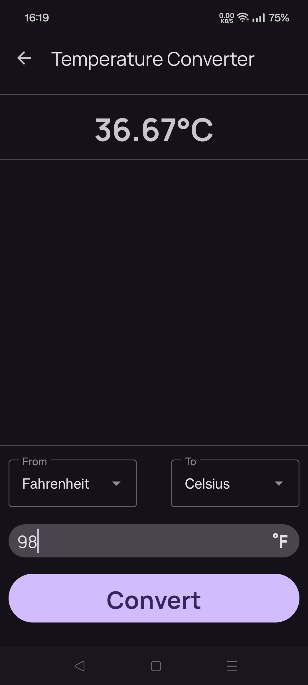

    
    <h1>PocketBox</h1>
    
<b>PocketBox</b> is a suite of useful Utilities comprised into a single Android app.

## Features
- **Calculate Total:** Given a subtotal cost and a tax percentage, calculate the total cost.
- **Calculate Tip:** Given a total cost and a tip percentage, calculate the tip amount.
- **Temperature Convertor:** Convert between Celsius, Fahrenheit, and Kelvin.
- **Number Formatter:** Format numbers into words. E.g. `123456` -> `123.46 Thousand`.
- **Days Apart:** Calculate the number of days between two dates.
- **Percent Calculator:** Calculate the percent difference between two numbers.

 

## Screenshots

    
    
    
    
    
    

 

## Installation

## Acknowledgements
- [**Material Components for Android**](https://github.com/material-components/material-components-android)
- [**AndroidX**](https://github.com/androidx/androidx)
- [**Material Design Icons**](https://pictogrammers.com/library/mdi/): Icons used in the app.

 

## License
This program is free software: you can redistribute it and/or modify
it under the terms of the GNU General Public License as published by
the Free Software Foundation, either version 3 of the License, or
(at your option) any later version.

This program is distributed in the hope that it will be useful,
but WITHOUT ANY WARRANTY; without even the implied warranty of
MERCHANTABILITY or FITNESS FOR A PARTICULAR PURPOSE.  See [LICENSE](./LICENSE) for more details.